## 将第一节课实践的DCGAN代码改成lsgan的损失函数

可以看下有提示的地方。


```python
#导入一些必要的包
import os
import random
import paddle 
import paddle.nn as nn
import paddle.optimizer as optim
import paddle.vision.datasets as dset
import paddle.vision.transforms as transforms
import numpy as np
import matplotlib.pyplot as plt
import matplotlib.animation as animation
```

    /opt/conda/envs/python35-paddle120-env/lib/python3.7/site-packages/matplotlib/__init__.py:107: DeprecationWarning: Using or importing the ABCs from 'collections' instead of from 'collections.abc' is deprecated, and in 3.8 it will stop working
      from collections import MutableMapping
    /opt/conda/envs/python35-paddle120-env/lib/python3.7/site-packages/matplotlib/rcsetup.py:20: DeprecationWarning: Using or importing the ABCs from 'collections' instead of from 'collections.abc' is deprecated, and in 3.8 it will stop working
      from collections import Iterable, Mapping
    /opt/conda/envs/python35-paddle120-env/lib/python3.7/site-packages/matplotlib/colors.py:53: DeprecationWarning: Using or importing the ABCs from 'collections' instead of from 'collections.abc' is deprecated, and in 3.8 it will stop working
      from collections import Sized


```python
demo_dataset = paddle.vision.datasets.MNIST(mode='train')
demo_dataset.labels[5][0]
demo_dataset[5][0]
```


```python
dataset = paddle.vision.datasets.MNIST(mode='train', 
                                        transform=transforms.Compose([
                                        # resize ->(32,32)
                                        transforms.Resize((32,32)),
                                        # 归一化到-1~1
                                        transforms.Normalize([127.5], [127.5])
                                    ]))

dataloader = paddle.io.DataLoader(dataset, batch_size=32,
                                  shuffle=True, num_workers=4)
```


```python
#参数初始化的模块
@paddle.no_grad()
def normal_(x, mean=0., std=1.):
    temp_value = paddle.normal(mean, std, shape=x.shape)
    x.set_value(temp_value)
    return x

@paddle.no_grad()
def uniform_(x, a=-1., b=1.):
    temp_value = paddle.uniform(min=a, max=b, shape=x.shape)
    x.set_value(temp_value)
    return x

@paddle.no_grad()
def constant_(x, value):
    temp_value = paddle.full(x.shape, value, x.dtype)
    x.set_value(temp_value)
    return x

def weights_init(m):
    classname = m.__class__.__name__
    if hasattr(m, 'weight') and classname.find('Conv') != -1:
        normal_(m.weight, 0.0, 0.02)
    elif classname.find('BatchNorm') != -1:
        normal_(m.weight, 1.0, 0.02)
        constant_(m.bias, 0)
```


```python
# Generator Code
class Generator(nn.Layer):
    def __init__(self, ):
        super(Generator, self).__init__()
        self.gen = nn.Sequential(
            # input is Z, [B, 100, 1, 1] -> [B, 64 * 4, 4, 4]
            nn.Conv2DTranspose(100, 64 * 4, 4, 1, 0, bias_attr=False),
            nn.BatchNorm2D(64 * 4),
            nn.ReLU(True),
            # state size. [B, 64 * 4, 4, 4] -> [B, 64 * 2, 8, 8]
            nn.Conv2DTranspose(64 * 4, 64 * 2, 4, 2, 1, bias_attr=False),
            nn.BatchNorm2D(64 * 2),
            nn.ReLU(True),
            # state size. [B, 64 * 2, 8, 8] -> [B, 64, 16, 16]
            nn.Conv2DTranspose( 64 * 2, 64, 4, 2, 1, bias_attr=False),
            nn.BatchNorm2D(64),
            nn.ReLU(True),
            # state size. [B, 64, 16, 16] -> [B, 1, 32, 32]
            nn.Conv2DTranspose( 64, 1, 4, 2, 1, bias_attr=False),
            nn.Tanh()
        )

    def forward(self, x):
        return self.gen(x)


netG = Generator()
# Apply the weights_init function to randomly initialize all weights
#  to mean=0, stdev=0.2.
netG.apply(weights_init)

# Print the model
print(netG)
```

    Generator(
      (gen): Sequential(
        (0): Conv2DTranspose(100, 256, kernel_size=[4, 4], data_format=NCHW)
        (1): BatchNorm2D(num_features=256, momentum=0.9, epsilon=1e-05)
        (2): ReLU(name=True)
        (3): Conv2DTranspose(256, 128, kernel_size=[4, 4], stride=[2, 2], padding=1, data_format=NCHW)
        (4): BatchNorm2D(num_features=128, momentum=0.9, epsilon=1e-05)
        (5): ReLU(name=True)
        (6): Conv2DTranspose(128, 64, kernel_size=[4, 4], stride=[2, 2], padding=1, data_format=NCHW)
        (7): BatchNorm2D(num_features=64, momentum=0.9, epsilon=1e-05)
        (8): ReLU(name=True)
        (9): Conv2DTranspose(64, 1, kernel_size=[4, 4], stride=[2, 2], padding=1, data_format=NCHW)
        (10): Tanh()
      )
    )


```python
class Discriminator(nn.Layer):
    def __init__(self,):
        super(Discriminator, self).__init__()
        self.dis = nn.Sequential(

            # input [B, 1, 32, 32] -> [B, 64, 16, 16]
            nn.Conv2D(1, 64, 4, 2, 1, bias_attr=False),
            nn.LeakyReLU(0.2),

            # state size. [B, 64, 16, 16] -> [B, 128, 8, 8]
            nn.Conv2D(64, 64 * 2, 4, 2, 1, bias_attr=False),
            nn.BatchNorm2D(64 * 2),
            nn.LeakyReLU(0.2),

            # state size. [B, 128, 8, 8] -> [B, 256, 4, 4]
            nn.Conv2D(64 * 2, 64 * 4, 4, 2, 1, bias_attr=False),
            nn.BatchNorm2D(64 * 4),
            nn.LeakyReLU(0.2),

            # state size. [B, 256, 4, 4] -> [B, 1, 1, 1]
            nn.Conv2D(64 * 4, 1, 4, 1, 0, bias_attr=False),
            # 这里为需要改变的地方
            # nn.Sigmoid()
        )

    def forward(self, x):
        return self.dis(x)

netD = Discriminator()
netD.apply(weights_init)
print(netD)
```

    Discriminator(
      (dis): Sequential(
        (0): Conv2D(1, 64, kernel_size=[4, 4], stride=[2, 2], padding=1, data_format=NCHW)
        (1): LeakyReLU(negative_slope=0.2)
        (2): Conv2D(64, 128, kernel_size=[4, 4], stride=[2, 2], padding=1, data_format=NCHW)
        (3): BatchNorm2D(num_features=128, momentum=0.9, epsilon=1e-05)
        (4): LeakyReLU(negative_slope=0.2)
        (5): Conv2D(128, 256, kernel_size=[4, 4], stride=[2, 2], padding=1, data_format=NCHW)
        (6): BatchNorm2D(num_features=256, momentum=0.9, epsilon=1e-05)
        (7): LeakyReLU(negative_slope=0.2)
        (8): Conv2D(256, 1, kernel_size=[4, 4], data_format=NCHW)
        (9): LeakyReLU(negative_slope=0.2)
      )
    )


```python
# Initialize BCELoss function
# 这里为需要改变的地方
loss = nn.MSELoss()  #nn.BCELoss()


# Create batch of latent vectors that we will use to visualize
#  the progression of the generator
fixed_noise = paddle.randn([32, 100, 1, 1], dtype='float32')

# Establish convention for real and fake labels during training
real_label = 1.
fake_label = 0.

# Setup Adam optimizers for both G and D
optimizerD = optim.Adam(parameters=netD.parameters(), learning_rate=0.0002, beta1=0.5, beta2=0.999)
optimizerG = optim.Adam(parameters=netG.parameters(), learning_rate=0.0002, beta1=0.5, beta2=0.999)

```


```python
losses = [[], []]
#plt.ion()
now = 0
for pass_id in range(100):
    for batch_id, (data, target) in enumerate(dataloader):
        ############################
        # (1) Update D network: maximize log(D(x)) + log(1 - D(G(z)))
        ###########################

        optimizerD.clear_grad()
        real_img = data
        bs_size = real_img.shape[0]
        label = paddle.full((bs_size, 1, 1, 1), real_label, dtype='float32')
        real_out = netD(real_img)
        errD_real = loss(real_out, label)
        errD_real.backward()

        noise = paddle.randn([bs_size, 100, 1, 1], 'float32')
        fake_img = netG(noise)
        label = paddle.full((bs_size, 1, 1, 1), fake_label, dtype='float32')
        fake_out = netD(fake_img.detach())
        errD_fake = loss(fake_out,label)
        errD_fake.backward()
        optimizerD.step()
        optimizerD.clear_grad()

        errD = errD_real + errD_fake
        losses[0].append(errD.numpy()[0])

        ############################
        # (2) Update G network: maximize log(D(G(z)))
        ###########################
        optimizerG.clear_grad()
        noise = paddle.randn([bs_size, 100, 1, 1],'float32')
        fake = netG(noise)
        label = paddle.full((bs_size, 1, 1, 1), real_label, dtype=np.float32,)
        output = netD(fake)
        errG = loss(output,label)
        errG.backward()
        optimizerG.step()
        optimizerG.clear_grad()

        losses[1].append(errG.numpy()[0])


        ############################
        # visualize
        ###########################
        if batch_id % 900 == 0:
            generated_image = netG(noise).numpy()
            imgs = []
            plt.figure(figsize=(15,15))
            try:
                for i in range(10):
                    image = generated_image[i].transpose()
                    image = np.where(image > 0, image, 0)
                    image = image.transpose((1,0,2))
                    plt.subplot(10, 10, i + 1)
                    
                    plt.imshow(image[...,0], vmin=-1, vmax=1)
                    plt.axis('off')
                    plt.xticks([])
                    plt.yticks([])
                    plt.subplots_adjust(wspace=0.1, hspace=0.1)
                msg = 'Epoch ID={0}, Batch ID={1} \n\n D-Loss={2}, G-Loss={3}'.format(pass_id, batch_id, errD.numpy()[0], errG.numpy()[0])
                print(msg)
                plt.suptitle(msg,fontsize=15)
                plt.draw()
                plt.savefig('{}/{:04d}_{:04d}.png'.format('work', pass_id, batch_id), bbox_inches='tight')
                plt.pause(0.01)
            except IOError:
                print(IOError)
    paddle.save(netG.state_dict(), "work/generator.params")
```

    /opt/conda/envs/python35-paddle120-env/lib/python3.7/site-packages/paddle/nn/layer/norm.py:648: UserWarning: When training, we now always track global mean and variance.
      "When training, we now always track global mean and variance.")
    /opt/conda/envs/python35-paddle120-env/lib/python3.7/site-packages/matplotlib/cbook/__init__.py:2349: DeprecationWarning: Using or importing the ABCs from 'collections' instead of from 'collections.abc' is deprecated, and in 3.8 it will stop working
      if isinstance(obj, collections.Iterator):
    /opt/conda/envs/python35-paddle120-env/lib/python3.7/site-packages/matplotlib/cbook/__init__.py:2366: DeprecationWarning: Using or importing the ABCs from 'collections' instead of from 'collections.abc' is deprecated, and in 3.8 it will stop working
      return list(data) if isinstance(data, collections.MappingView) else data
    /opt/conda/envs/python35-paddle120-env/lib/python3.7/site-packages/numpy/lib/type_check.py:546: DeprecationWarning: np.asscalar(a) is deprecated since NumPy v1.16, use a.item() instead
      'a.item() instead', DeprecationWarning, stacklevel=1)


    Epoch ID=0, Batch ID=0 
    
     D-Loss=1.224705457687378, G-Loss=2.672750473022461


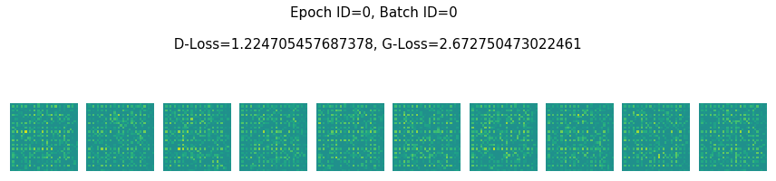


    Epoch ID=0, Batch ID=900 
    
     D-Loss=0.10254663974046707, G-Loss=3.7121634483337402


    Epoch ID=0, Batch ID=1800 
    
     D-Loss=0.2643445134162903, G-Loss=2.9191718101501465


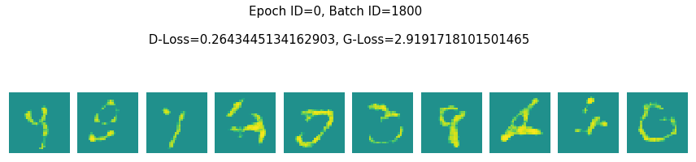


    Epoch ID=1, Batch ID=0 
    
     D-Loss=0.19180911779403687, G-Loss=2.9010887145996094


    Epoch ID=1, Batch ID=900 
    
     D-Loss=0.2514994740486145, G-Loss=3.3117895126342773


    Epoch ID=1, Batch ID=1800 
    
     D-Loss=0.5252712965011597, G-Loss=2.283358573913574


    Epoch ID=2, Batch ID=0 
    
     D-Loss=0.49605363607406616, G-Loss=2.3322744369506836


    Epoch ID=2, Batch ID=900 
    
     D-Loss=0.23429667949676514, G-Loss=2.7630369663238525


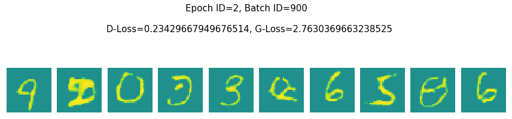


    Epoch ID=2, Batch ID=1800 
    
     D-Loss=0.2464008331298828, G-Loss=3.0158352851867676


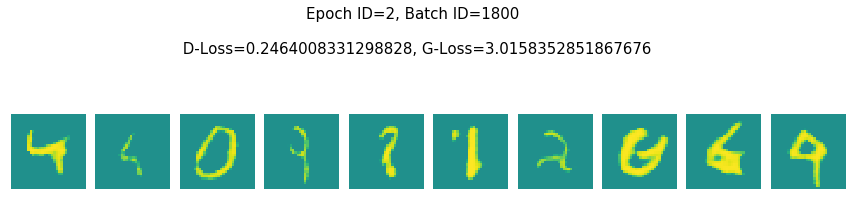


    Epoch ID=3, Batch ID=0 
    
     D-Loss=0.21466058492660522, G-Loss=3.189915657043457


    Epoch ID=3, Batch ID=900 
    
     D-Loss=0.14199939370155334, G-Loss=3.249934196472168


    Epoch ID=3, Batch ID=1800 
    
     D-Loss=0.42363595962524414, G-Loss=3.01478910446167


    Epoch ID=4, Batch ID=0 
    
     D-Loss=0.22687578201293945, G-Loss=2.9051365852355957


    Epoch ID=4, Batch ID=900 
    
     D-Loss=0.11708207428455353, G-Loss=3.3163254261016846


    Epoch ID=4, Batch ID=1800 
    
     D-Loss=0.07222782075405121, G-Loss=3.1589503288269043


    Epoch ID=5, Batch ID=0 
    
     D-Loss=0.1403188556432724, G-Loss=3.377657175064087


    Epoch ID=5, Batch ID=900 
    
     D-Loss=0.15121708810329437, G-Loss=4.296824932098389


    Epoch ID=5, Batch ID=1800 
    
     D-Loss=0.03762737661600113, G-Loss=3.5862879753112793


    Epoch ID=6, Batch ID=0 
    
     D-Loss=0.08828525245189667, G-Loss=3.255825996398926


    Epoch ID=6, Batch ID=900 
    
     D-Loss=0.03290998935699463, G-Loss=4.298041343688965


    Epoch ID=6, Batch ID=1800 
    
     D-Loss=0.019138304516673088, G-Loss=3.4713523387908936


    Epoch ID=7, Batch ID=0 
    
     D-Loss=0.030891450121998787, G-Loss=3.27350115776062


    Epoch ID=7, Batch ID=900 
    
     D-Loss=0.03796076774597168, G-Loss=4.126004695892334


    Epoch ID=7, Batch ID=1800 
    
     D-Loss=0.05138225480914116, G-Loss=3.2936081886291504


    Epoch ID=8, Batch ID=0 
    
     D-Loss=0.047922346740961075, G-Loss=4.502845764160156


    Epoch ID=8, Batch ID=900 
    
     D-Loss=0.07069100439548492, G-Loss=3.869349241256714


    Epoch ID=8, Batch ID=1800 
    
     D-Loss=0.08113110810518265, G-Loss=3.9322261810302734


    Epoch ID=9, Batch ID=0 
    
     D-Loss=0.3031924366950989, G-Loss=4.178133487701416


    Epoch ID=9, Batch ID=900 
    
     D-Loss=0.020995764061808586, G-Loss=3.8248448371887207


    Epoch ID=9, Batch ID=1800 
    
     D-Loss=0.0809246152639389, G-Loss=3.580061197280884


    Epoch ID=10, Batch ID=0 
    
     D-Loss=0.025533471256494522, G-Loss=3.6014533042907715


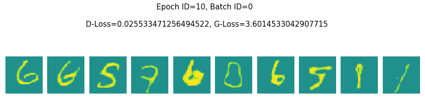


    Epoch ID=10, Batch ID=900 
    
     D-Loss=0.09719139337539673, G-Loss=3.624941825866699


    Epoch ID=10, Batch ID=1800 
    
     D-Loss=0.023505428805947304, G-Loss=3.707927942276001


    Epoch ID=11, Batch ID=0 
    
     D-Loss=0.036097727715969086, G-Loss=3.6075923442840576


    Epoch ID=11, Batch ID=900 
    
     D-Loss=0.13489842414855957, G-Loss=3.7330527305603027


    Epoch ID=11, Batch ID=1800 
    
     D-Loss=0.026478001847863197, G-Loss=3.943774461746216


    Epoch ID=12, Batch ID=0 
    
     D-Loss=0.03519753739237785, G-Loss=4.014451026916504


    Epoch ID=12, Batch ID=900 
    
     D-Loss=0.02287823148071766, G-Loss=4.237682342529297


    Epoch ID=12, Batch ID=1800 
    
     D-Loss=0.06745196878910065, G-Loss=4.237314224243164


    Epoch ID=13, Batch ID=0 
    
     D-Loss=0.05009646713733673, G-Loss=3.871572971343994


    Epoch ID=13, Batch ID=900 
    
     D-Loss=0.011481210589408875, G-Loss=3.757539749145508


    Epoch ID=13, Batch ID=1800 
    
     D-Loss=0.08609288930892944, G-Loss=3.444936752319336


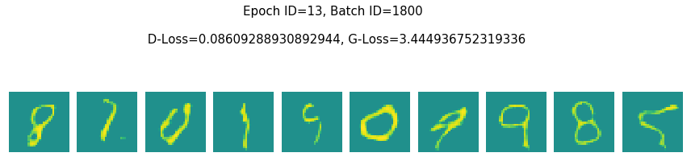


    Epoch ID=14, Batch ID=0 
    
     D-Loss=0.018938422203063965, G-Loss=3.6887965202331543


    Epoch ID=14, Batch ID=900 
    
     D-Loss=0.047476738691329956, G-Loss=3.967653751373291


    Epoch ID=14, Batch ID=1800 
    
     D-Loss=0.044332318007946014, G-Loss=3.8664309978485107


    Epoch ID=15, Batch ID=0 
    
     D-Loss=0.01697208732366562, G-Loss=4.086209774017334


    Epoch ID=15, Batch ID=900 
    
     D-Loss=0.011821926571428776, G-Loss=3.817622423171997


    Epoch ID=15, Batch ID=1800 
    
     D-Loss=0.025337357074022293, G-Loss=4.076663017272949


    Epoch ID=16, Batch ID=0 
    
     D-Loss=0.04161788150668144, G-Loss=3.913080930709839


    Epoch ID=16, Batch ID=900 
    
     D-Loss=0.21191339194774628, G-Loss=3.738898754119873


    Epoch ID=16, Batch ID=1800 
    
     D-Loss=0.021519798785448074, G-Loss=4.012302398681641


    Epoch ID=17, Batch ID=0 
    
     D-Loss=0.008583909831941128, G-Loss=4.039409637451172


    Epoch ID=17, Batch ID=900 
    
     D-Loss=0.019619358703494072, G-Loss=4.069747447967529


    Epoch ID=17, Batch ID=1800 
    
     D-Loss=0.01077517494559288, G-Loss=3.7992961406707764


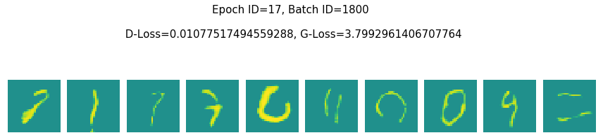


    Epoch ID=18, Batch ID=0 
    
     D-Loss=0.012098360806703568, G-Loss=3.5354018211364746


    Epoch ID=18, Batch ID=900 
    
     D-Loss=0.02073061466217041, G-Loss=3.7810895442962646


    Epoch ID=18, Batch ID=1800 
    
     D-Loss=0.028595028445124626, G-Loss=3.426875114440918


    Epoch ID=19, Batch ID=0 
    
     D-Loss=0.021450698375701904, G-Loss=4.190295219421387


    Epoch ID=19, Batch ID=900 
    
     D-Loss=0.23733843863010406, G-Loss=3.5132341384887695


    Epoch ID=19, Batch ID=1800 
    
     D-Loss=0.012695626355707645, G-Loss=3.8171515464782715


    Epoch ID=20, Batch ID=0 
    
     D-Loss=0.023339876905083656, G-Loss=3.913288116455078


    Epoch ID=20, Batch ID=900 
    
     D-Loss=0.038035206496715546, G-Loss=3.6390886306762695


    Epoch ID=20, Batch ID=1800 
    
     D-Loss=0.2509661316871643, G-Loss=4.358950614929199


    Epoch ID=21, Batch ID=0 
    
     D-Loss=0.03568146377801895, G-Loss=4.126660346984863


    Epoch ID=21, Batch ID=900 
    
     D-Loss=0.026621270924806595, G-Loss=3.921909809112549


    Epoch ID=21, Batch ID=1800 
    
     D-Loss=0.015481837093830109, G-Loss=3.8839588165283203


    Epoch ID=22, Batch ID=0 
    
     D-Loss=0.13890431821346283, G-Loss=3.145859718322754


    Epoch ID=22, Batch ID=900 
    
     D-Loss=0.03237283229827881, G-Loss=4.089310646057129


    Epoch ID=22, Batch ID=1800 
    
     D-Loss=0.0307802464812994, G-Loss=3.5780723094940186


    Epoch ID=23, Batch ID=0 
    
     D-Loss=0.03176382556557655, G-Loss=3.781280755996704


    Epoch ID=23, Batch ID=900 
    
     D-Loss=0.2167070508003235, G-Loss=4.669855117797852


    Epoch ID=23, Batch ID=1800 
    
     D-Loss=0.02415376901626587, G-Loss=3.83162260055542


    Epoch ID=24, Batch ID=0 
    
     D-Loss=0.02486427128314972, G-Loss=3.941181182861328


    Epoch ID=24, Batch ID=900 
    
     D-Loss=0.021445199847221375, G-Loss=4.394356727600098


    Epoch ID=24, Batch ID=1800 
    
     D-Loss=0.10540550947189331, G-Loss=4.145435333251953


    Epoch ID=25, Batch ID=0 
    
     D-Loss=0.02391718700528145, G-Loss=3.751537799835205


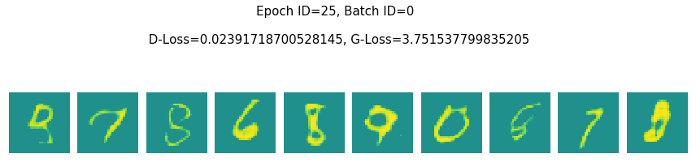


    Epoch ID=25, Batch ID=900 
    
     D-Loss=0.02528940886259079, G-Loss=3.7596254348754883


    Epoch ID=25, Batch ID=1800 
    
     D-Loss=0.052166104316711426, G-Loss=4.066113471984863


    Epoch ID=26, Batch ID=0 
    
     D-Loss=0.00752823892980814, G-Loss=3.8979995250701904


    Epoch ID=26, Batch ID=900 
    
     D-Loss=0.014441014267504215, G-Loss=3.852900981903076


    Epoch ID=26, Batch ID=1800 
    
     D-Loss=0.013563268817961216, G-Loss=4.1682562828063965


    Epoch ID=27, Batch ID=0 
    
     D-Loss=0.01005377247929573, G-Loss=3.8635191917419434


    Epoch ID=27, Batch ID=900 
    
     D-Loss=0.0061956001445651054, G-Loss=3.72800874710083


    Epoch ID=27, Batch ID=1800 
    
     D-Loss=0.007582181133329868, G-Loss=4.235663414001465


    Epoch ID=28, Batch ID=0 
    
     D-Loss=0.005287949461489916, G-Loss=3.693500518798828


    Epoch ID=28, Batch ID=900 
    
     D-Loss=0.11829577386379242, G-Loss=3.3591995239257812


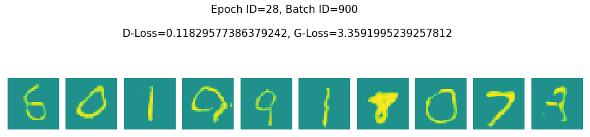


    Epoch ID=28, Batch ID=1800 
    
     D-Loss=0.008179496973752975, G-Loss=3.670835494995117


    Epoch ID=29, Batch ID=0 
    
     D-Loss=0.00809736829251051, G-Loss=4.006290435791016


    Epoch ID=29, Batch ID=900 
    
     D-Loss=0.008984885178506374, G-Loss=3.8954782485961914


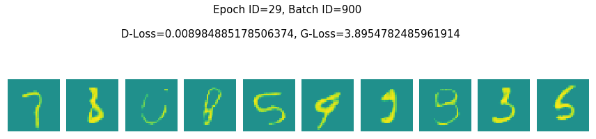


    Epoch ID=29, Batch ID=1800 
    
     D-Loss=0.02757294476032257, G-Loss=4.158529281616211


    Epoch ID=30, Batch ID=0 
    
     D-Loss=0.01276969350874424, G-Loss=3.5936083793640137


    Epoch ID=30, Batch ID=900 
    
     D-Loss=0.004874450154602528, G-Loss=4.069645881652832


    Epoch ID=30, Batch ID=1800 
    
     D-Loss=0.013940390199422836, G-Loss=3.7435965538024902


    Epoch ID=31, Batch ID=0 
    
     D-Loss=0.012230387888848782, G-Loss=4.035299777984619


    Epoch ID=31, Batch ID=900 
    
     D-Loss=0.0062529947608709335, G-Loss=3.9557435512542725


    Epoch ID=31, Batch ID=1800 
    
     D-Loss=0.01195378229022026, G-Loss=4.052096366882324


    Epoch ID=32, Batch ID=0 
    
     D-Loss=0.014425160363316536, G-Loss=4.004998207092285


    Epoch ID=32, Batch ID=900 
    
     D-Loss=0.054390329867601395, G-Loss=3.9763734340667725


    Epoch ID=32, Batch ID=1800 
    
     D-Loss=0.0045217303559184074, G-Loss=4.40097188949585


    Epoch ID=33, Batch ID=0 
    
     D-Loss=0.008647195063531399, G-Loss=3.797121047973633


    Epoch ID=33, Batch ID=900 
    
     D-Loss=0.0064545730128884315, G-Loss=3.9268016815185547


    Epoch ID=33, Batch ID=1800 
    
     D-Loss=0.25730428099632263, G-Loss=4.937874794006348


    Epoch ID=34, Batch ID=0 
    
     D-Loss=0.014452528208494186, G-Loss=3.7205822467803955


    Epoch ID=34, Batch ID=900 
    
     D-Loss=0.009299655444920063, G-Loss=3.977250814437866


    Epoch ID=34, Batch ID=1800 
    
     D-Loss=0.10484755039215088, G-Loss=4.230348110198975


    Epoch ID=35, Batch ID=0 
    
     D-Loss=0.2755531668663025, G-Loss=4.3010711669921875


    Epoch ID=35, Batch ID=900 
    
     D-Loss=0.007175670936703682, G-Loss=4.0430684089660645


    Epoch ID=35, Batch ID=1800 
    
     D-Loss=0.00792502611875534, G-Loss=3.755605697631836


    Epoch ID=36, Batch ID=0 
    
     D-Loss=0.01325989980250597, G-Loss=4.029581069946289


    Epoch ID=36, Batch ID=900 
    
     D-Loss=0.009964000433683395, G-Loss=3.9045677185058594


    Epoch ID=36, Batch ID=1800 
    
     D-Loss=0.0142953647300601, G-Loss=4.306257247924805


    Epoch ID=37, Batch ID=0 
    
     D-Loss=0.01411025132983923, G-Loss=3.904906749725342


    Epoch ID=37, Batch ID=900 
    
     D-Loss=0.008466344326734543, G-Loss=3.7459421157836914


    Epoch ID=37, Batch ID=1800 
    
     D-Loss=0.017388977110385895, G-Loss=3.9427974224090576


    Epoch ID=38, Batch ID=0 
    
     D-Loss=0.047556072473526, G-Loss=4.127774238586426


    Epoch ID=38, Batch ID=900 
    
     D-Loss=0.02118062973022461, G-Loss=4.243874549865723


    Epoch ID=38, Batch ID=1800 
    
     D-Loss=0.06042985990643501, G-Loss=3.972567558288574


    Epoch ID=39, Batch ID=0 
    
     D-Loss=0.009946400299668312, G-Loss=3.7765860557556152


    Epoch ID=39, Batch ID=900 
    
     D-Loss=0.006037615705281496, G-Loss=4.09128475189209


    Epoch ID=39, Batch ID=1800 
    
     D-Loss=0.029047908261418343, G-Loss=3.83884334564209


    Epoch ID=40, Batch ID=0 
    
     D-Loss=0.025148876011371613, G-Loss=3.8310580253601074


    Epoch ID=40, Batch ID=900 
    
     D-Loss=0.01038812194019556, G-Loss=4.109728813171387


    Epoch ID=40, Batch ID=1800 
    
     D-Loss=0.007736844010651112, G-Loss=3.51918363571167


    Epoch ID=41, Batch ID=0 
    
     D-Loss=0.00870168674737215, G-Loss=3.6750612258911133


    Epoch ID=41, Batch ID=900 
    
     D-Loss=0.016049783676862717, G-Loss=3.7896933555603027


    Epoch ID=41, Batch ID=1800 
    
     D-Loss=0.007978144101798534, G-Loss=4.222769260406494


    Epoch ID=42, Batch ID=0 
    
     D-Loss=0.004808017052710056, G-Loss=4.070794105529785


    Epoch ID=42, Batch ID=900 
    
     D-Loss=0.007111220620572567, G-Loss=3.8273980617523193


    Epoch ID=42, Batch ID=1800 
    
     D-Loss=0.008190933614969254, G-Loss=3.8275976181030273


    Epoch ID=43, Batch ID=0 
    
     D-Loss=0.004800649359822273, G-Loss=4.007235527038574


    Epoch ID=43, Batch ID=900 
    
     D-Loss=0.00820108875632286, G-Loss=3.952671527862549


    Epoch ID=43, Batch ID=1800 
    
     D-Loss=0.0308719202876091, G-Loss=4.267273902893066


    Epoch ID=44, Batch ID=0 
    
     D-Loss=0.002725959289819002, G-Loss=3.8232736587524414


    Epoch ID=44, Batch ID=900 
    
     D-Loss=0.020396841689944267, G-Loss=4.400326728820801


    Epoch ID=44, Batch ID=1800 
    
     D-Loss=0.021760383620858192, G-Loss=3.7146987915039062


    Epoch ID=45, Batch ID=0 
    
     D-Loss=0.005393489263951778, G-Loss=3.8387393951416016


    Epoch ID=45, Batch ID=900 
    
     D-Loss=0.006973475683480501, G-Loss=3.875328540802002


    Epoch ID=45, Batch ID=1800 
    
     D-Loss=0.04047209396958351, G-Loss=3.6484627723693848


    Epoch ID=46, Batch ID=0 
    
     D-Loss=0.022137057036161423, G-Loss=3.9414005279541016


    Epoch ID=46, Batch ID=900 
    
     D-Loss=0.0303820613771677, G-Loss=3.6589179039001465


    Epoch ID=46, Batch ID=1800 
    
     D-Loss=0.007844703271985054, G-Loss=3.729094982147217


    Epoch ID=47, Batch ID=0 
    
     D-Loss=0.029617933556437492, G-Loss=4.232013702392578


    Epoch ID=47, Batch ID=900 
    
     D-Loss=0.006555842701345682, G-Loss=3.914766788482666


    Epoch ID=47, Batch ID=1800 
    
     D-Loss=0.02528403326869011, G-Loss=3.6154212951660156


    Epoch ID=48, Batch ID=0 
    
     D-Loss=0.06169991195201874, G-Loss=5.012115478515625


    Epoch ID=48, Batch ID=900 
    
     D-Loss=0.027554791420698166, G-Loss=4.171446800231934


    Epoch ID=48, Batch ID=1800 
    
     D-Loss=0.006877297069877386, G-Loss=4.014183521270752


    Epoch ID=49, Batch ID=0 
    
     D-Loss=0.008284347131848335, G-Loss=3.697451591491699


    Epoch ID=49, Batch ID=900 
    
     D-Loss=0.013131663203239441, G-Loss=3.642894744873047


    Epoch ID=49, Batch ID=1800 
    
     D-Loss=0.013320619240403175, G-Loss=4.3311309814453125


    Epoch ID=50, Batch ID=0 
    
     D-Loss=0.0041450029239058495, G-Loss=3.99306058883667


    Epoch ID=50, Batch ID=900 
    
     D-Loss=0.008865266107022762, G-Loss=3.8980250358581543


    Epoch ID=50, Batch ID=1800 
    
     D-Loss=0.002998956013470888, G-Loss=3.93670654296875


    Epoch ID=51, Batch ID=0 
    
     D-Loss=0.01946013793349266, G-Loss=3.9118432998657227


    Epoch ID=51, Batch ID=900 
    
     D-Loss=0.01048690639436245, G-Loss=3.7426998615264893


    Epoch ID=51, Batch ID=1800 
    
     D-Loss=0.039834462106227875, G-Loss=3.8313655853271484


    Epoch ID=52, Batch ID=0 
    
     D-Loss=0.01757625862956047, G-Loss=3.879444122314453


    Epoch ID=52, Batch ID=900 
    
     D-Loss=0.014624401926994324, G-Loss=4.286167621612549


    Epoch ID=52, Batch ID=1800 
    
     D-Loss=0.01610148698091507, G-Loss=3.7947943210601807


    Epoch ID=53, Batch ID=0 
    
     D-Loss=0.01519066747277975, G-Loss=3.863025426864624


    Epoch ID=53, Batch ID=900 
    
     D-Loss=0.011671078391373158, G-Loss=4.270698547363281


    Epoch ID=53, Batch ID=1800 
    
     D-Loss=0.005616419017314911, G-Loss=3.835109233856201


    Epoch ID=54, Batch ID=0 
    
     D-Loss=0.044662825763225555, G-Loss=4.069635391235352


    Epoch ID=54, Batch ID=900 
    
     D-Loss=0.00991364661604166, G-Loss=4.0638532638549805


    Epoch ID=54, Batch ID=1800 
    
     D-Loss=0.006590403616428375, G-Loss=3.998493194580078


    Epoch ID=55, Batch ID=0 
    
     D-Loss=0.01142975315451622, G-Loss=3.854124069213867


    Epoch ID=55, Batch ID=900 
    
     D-Loss=0.012979591265320778, G-Loss=3.728647232055664


    Epoch ID=55, Batch ID=1800 
    
     D-Loss=0.005327953025698662, G-Loss=4.425680160522461


    Epoch ID=56, Batch ID=0 
    
     D-Loss=0.006056386511772871, G-Loss=3.982801914215088


    Epoch ID=56, Batch ID=900 
    
     D-Loss=0.004562424495816231, G-Loss=4.010916233062744


    Epoch ID=56, Batch ID=1800 
    
     D-Loss=0.003367876634001732, G-Loss=4.06693172454834


    Epoch ID=57, Batch ID=0 
    
     D-Loss=0.009170603938400745, G-Loss=4.110441207885742


    Epoch ID=57, Batch ID=900 
    
     D-Loss=0.0068869320675730705, G-Loss=3.958326578140259


    Epoch ID=57, Batch ID=1800 
    
     D-Loss=0.002777094952762127, G-Loss=4.131399154663086


    Epoch ID=58, Batch ID=0 
    
     D-Loss=0.005528489127755165, G-Loss=3.8798656463623047


    Epoch ID=58, Batch ID=900 
    
     D-Loss=0.018597643822431564, G-Loss=3.594217300415039


    Epoch ID=58, Batch ID=1800 
    
     D-Loss=0.0063362717628479, G-Loss=3.966625213623047


    Epoch ID=59, Batch ID=0 
    
     D-Loss=0.008362313732504845, G-Loss=3.86720609664917


    Epoch ID=59, Batch ID=900 
    
     D-Loss=0.004281741566956043, G-Loss=4.030001640319824


    Epoch ID=59, Batch ID=1800 
    
     D-Loss=0.011185393668711185, G-Loss=3.7532601356506348


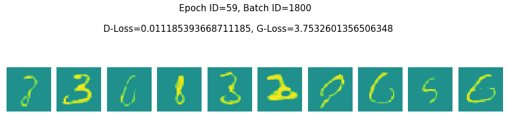


    Epoch ID=60, Batch ID=0 
    
     D-Loss=0.004841323476284742, G-Loss=3.3648085594177246


    Epoch ID=60, Batch ID=900 
    
     D-Loss=0.0032930304296314716, G-Loss=3.8479819297790527


    Epoch ID=60, Batch ID=1800 
    
     D-Loss=0.006912262178957462, G-Loss=4.015233039855957


    Epoch ID=61, Batch ID=0 
    
     D-Loss=0.007393090054392815, G-Loss=4.066357612609863


    Epoch ID=61, Batch ID=900 
    
     D-Loss=0.01372526865452528, G-Loss=3.761995792388916


    Epoch ID=61, Batch ID=1800 
    
     D-Loss=0.006862820126116276, G-Loss=3.7105331420898438


    Epoch ID=62, Batch ID=0 
    
     D-Loss=0.0071510327979922295, G-Loss=3.836352825164795


    Epoch ID=62, Batch ID=900 
    
     D-Loss=0.0038662392180413008, G-Loss=4.2724409103393555


    Epoch ID=62, Batch ID=1800 
    
     D-Loss=0.028976179659366608, G-Loss=3.8779139518737793


    Epoch ID=63, Batch ID=0 
    
     D-Loss=0.007514340337365866, G-Loss=3.7909045219421387


    Epoch ID=63, Batch ID=900 
    
     D-Loss=0.007709496188908815, G-Loss=3.9382529258728027


    Epoch ID=63, Batch ID=1800 
    
     D-Loss=0.024794410914182663, G-Loss=3.7846121788024902


    Epoch ID=64, Batch ID=0 
    
     D-Loss=0.013084722682833672, G-Loss=4.006040573120117


    Epoch ID=64, Batch ID=900 
    
     D-Loss=0.03691787272691727, G-Loss=4.904844284057617


    Epoch ID=64, Batch ID=1800 
    
     D-Loss=0.009305496700108051, G-Loss=3.7160630226135254


    Epoch ID=65, Batch ID=0 
    
     D-Loss=0.007389307953417301, G-Loss=4.263324737548828


    Epoch ID=65, Batch ID=900 
    
     D-Loss=0.011074760928750038, G-Loss=3.919567584991455


    Epoch ID=65, Batch ID=1800 
    
     D-Loss=0.023824885487556458, G-Loss=3.808133125305176


    Epoch ID=66, Batch ID=0 
    
     D-Loss=0.007677345536649227, G-Loss=4.132859230041504


    Epoch ID=66, Batch ID=900 
    
     D-Loss=0.004984784405678511, G-Loss=3.9712319374084473


    Epoch ID=66, Batch ID=1800 
    
     D-Loss=0.002829162869602442, G-Loss=4.397005081176758


    Epoch ID=67, Batch ID=0 
    
     D-Loss=0.006721463054418564, G-Loss=4.054366111755371


    Epoch ID=67, Batch ID=900 
    
     D-Loss=0.06790028512477875, G-Loss=4.094712257385254


    Epoch ID=67, Batch ID=1800 
    
     D-Loss=0.008507573045790195, G-Loss=3.5998847484588623


    Epoch ID=68, Batch ID=0 
    
     D-Loss=0.014397277496755123, G-Loss=3.5332183837890625


    Epoch ID=68, Batch ID=900 
    
     D-Loss=0.040946025401353836, G-Loss=4.093852996826172


    Epoch ID=68, Batch ID=1800 
    
     D-Loss=0.012074781581759453, G-Loss=4.281827926635742


    Epoch ID=69, Batch ID=0 
    
     D-Loss=0.012387089431285858, G-Loss=4.010271072387695


    Epoch ID=69, Batch ID=900 
    
     D-Loss=0.003974088467657566, G-Loss=3.669724702835083


    Epoch ID=69, Batch ID=1800 
    
     D-Loss=0.010545006953179836, G-Loss=3.928384304046631


    Epoch ID=70, Batch ID=0 
    
     D-Loss=0.00933594536036253, G-Loss=4.010749340057373


    Epoch ID=70, Batch ID=900 
    
     D-Loss=0.0030891369096934795, G-Loss=3.8064284324645996


    Epoch ID=70, Batch ID=1800 
    
     D-Loss=0.002989277709275484, G-Loss=3.7521090507507324


    Epoch ID=71, Batch ID=0 
    
     D-Loss=0.0031345938332378864, G-Loss=4.32985782623291


    Epoch ID=71, Batch ID=900 
    
     D-Loss=0.014915261417627335, G-Loss=3.9235501289367676


    Epoch ID=71, Batch ID=1800 
    
     D-Loss=0.006955786142498255, G-Loss=3.975527048110962


    Epoch ID=72, Batch ID=0 
    
     D-Loss=0.014897136017680168, G-Loss=3.696316957473755


    Epoch ID=72, Batch ID=900 
    
     D-Loss=0.005531540140509605, G-Loss=3.7845141887664795


    Epoch ID=72, Batch ID=1800 
    
     D-Loss=0.0036649066023528576, G-Loss=4.136531829833984


    Epoch ID=73, Batch ID=0 
    
     D-Loss=0.010174473747611046, G-Loss=3.9618804454803467


    Epoch ID=73, Batch ID=900 
    
     D-Loss=0.013673530891537666, G-Loss=3.9983301162719727


    Epoch ID=73, Batch ID=1800 
    
     D-Loss=0.04730450361967087, G-Loss=3.752434730529785


    Epoch ID=74, Batch ID=0 
    
     D-Loss=0.003945345524698496, G-Loss=4.2335734367370605


    Epoch ID=74, Batch ID=900 
    
     D-Loss=0.019487634301185608, G-Loss=3.82088041305542


    Epoch ID=74, Batch ID=1800 
    
     D-Loss=0.008254691027104855, G-Loss=3.9045772552490234


    Epoch ID=75, Batch ID=0 
    
     D-Loss=0.010992428287863731, G-Loss=3.928532123565674


    Epoch ID=75, Batch ID=900 
    
     D-Loss=0.005315734539180994, G-Loss=3.8487720489501953


    Epoch ID=75, Batch ID=1800 
    
     D-Loss=0.0023751663975417614, G-Loss=3.8861026763916016


    Epoch ID=76, Batch ID=0 
    
     D-Loss=0.0031408891081809998, G-Loss=3.721524715423584


    Epoch ID=76, Batch ID=900 
    
     D-Loss=0.0010226040612906218, G-Loss=4.304893970489502


    Epoch ID=76, Batch ID=1800 
    
     D-Loss=0.0023341819178313017, G-Loss=3.819406509399414


    Epoch ID=77, Batch ID=0 
    
     D-Loss=0.006044987589120865, G-Loss=3.7932815551757812


    Epoch ID=77, Batch ID=900 
    
     D-Loss=0.00849415548145771, G-Loss=3.9002223014831543


    Epoch ID=77, Batch ID=1800 
    
     D-Loss=0.005139509215950966, G-Loss=3.568417549133301


    Epoch ID=78, Batch ID=0 
    
     D-Loss=0.012014155276119709, G-Loss=4.050946235656738


    Epoch ID=78, Batch ID=900 
    
     D-Loss=0.024693453684449196, G-Loss=3.9533910751342773


    Epoch ID=78, Batch ID=1800 
    
     D-Loss=0.018229559063911438, G-Loss=4.1160993576049805


    Epoch ID=79, Batch ID=0 
    
     D-Loss=0.0057018110528588295, G-Loss=3.9702510833740234


    Epoch ID=79, Batch ID=900 
    
     D-Loss=0.011285469867289066, G-Loss=4.135387420654297


    Epoch ID=79, Batch ID=1800 
    
     D-Loss=0.00361535488627851, G-Loss=3.8888401985168457


    Epoch ID=80, Batch ID=0 
    
     D-Loss=0.010733111761510372, G-Loss=4.0924577713012695


    Epoch ID=80, Batch ID=900 
    
     D-Loss=0.004952121526002884, G-Loss=3.960224151611328


    Epoch ID=80, Batch ID=1800 
    
     D-Loss=0.07791592180728912, G-Loss=4.8904829025268555


    Epoch ID=81, Batch ID=0 
    
     D-Loss=0.006901694927364588, G-Loss=4.0181379318237305


    Epoch ID=81, Batch ID=900 
    
     D-Loss=0.008444528095424175, G-Loss=4.251008987426758


    Epoch ID=81, Batch ID=1800 
    
     D-Loss=0.05296148359775543, G-Loss=4.024792671203613


    Epoch ID=82, Batch ID=0 
    
     D-Loss=0.004255904816091061, G-Loss=4.037294387817383


    Epoch ID=82, Batch ID=900 
    
     D-Loss=0.011374280788004398, G-Loss=4.008490562438965


    Epoch ID=82, Batch ID=1800 
    
     D-Loss=0.005996928084641695, G-Loss=3.6998515129089355


    Epoch ID=83, Batch ID=0 
    
     D-Loss=0.0051405224949121475, G-Loss=4.00478458404541


    Epoch ID=83, Batch ID=900 
    
     D-Loss=0.017641687765717506, G-Loss=3.8894243240356445


    Epoch ID=83, Batch ID=1800 
    
     D-Loss=0.002461240626871586, G-Loss=3.9642043113708496


    Epoch ID=84, Batch ID=0 
    
     D-Loss=0.0036003561690449715, G-Loss=3.751636266708374


    Epoch ID=84, Batch ID=900 
    
     D-Loss=0.0037961197085678577, G-Loss=3.762239456176758


    Epoch ID=84, Batch ID=1800 
    
     D-Loss=0.021179234609007835, G-Loss=3.8132879734039307


    Epoch ID=85, Batch ID=0 
    
     D-Loss=0.011409014463424683, G-Loss=4.105207920074463


    Epoch ID=85, Batch ID=900 
    
     D-Loss=0.00871220976114273, G-Loss=3.88407826423645


    Epoch ID=85, Batch ID=1800 
    
     D-Loss=0.024837151169776917, G-Loss=3.8956375122070312


    Epoch ID=86, Batch ID=0 
    
     D-Loss=0.004624796099960804, G-Loss=3.813469886779785


    Epoch ID=86, Batch ID=900 
    
     D-Loss=0.007908128201961517, G-Loss=4.419306755065918


    Epoch ID=86, Batch ID=1800 
    
     D-Loss=0.005542337894439697, G-Loss=3.6726126670837402


    Epoch ID=87, Batch ID=0 
    
     D-Loss=0.003951335325837135, G-Loss=4.120213508605957


    Epoch ID=87, Batch ID=900 
    
     D-Loss=0.003943677060306072, G-Loss=3.8166637420654297


    Epoch ID=87, Batch ID=1800 
    
     D-Loss=0.003522173035889864, G-Loss=4.057738304138184


    Epoch ID=88, Batch ID=0 
    
     D-Loss=0.00972000416368246, G-Loss=4.1114277839660645


    Epoch ID=88, Batch ID=900 
    
     D-Loss=0.008896687999367714, G-Loss=3.84871506690979


    Epoch ID=88, Batch ID=1800 
    
     D-Loss=0.00808412954211235, G-Loss=3.6226606369018555


    Epoch ID=89, Batch ID=0 
    
     D-Loss=0.0037380631547421217, G-Loss=3.9648046493530273


    Epoch ID=89, Batch ID=900 
    
     D-Loss=0.002023621229454875, G-Loss=4.056100845336914


    Epoch ID=89, Batch ID=1800 
    
     D-Loss=0.0029453064780682325, G-Loss=4.040058135986328


    Epoch ID=90, Batch ID=0 
    
     D-Loss=0.0057169850915670395, G-Loss=3.911393642425537


    Epoch ID=90, Batch ID=900 
    
     D-Loss=0.004970673006027937, G-Loss=4.145861625671387


    Epoch ID=90, Batch ID=1800 
    
     D-Loss=0.008558941073715687, G-Loss=3.9953136444091797


    Epoch ID=91, Batch ID=0 
    
     D-Loss=0.0039675598964095116, G-Loss=3.8769102096557617


    Epoch ID=91, Batch ID=900 
    
     D-Loss=0.004017081577330828, G-Loss=3.8397278785705566


    Epoch ID=91, Batch ID=1800 
    
     D-Loss=0.013253124430775642, G-Loss=4.0466790199279785


    Epoch ID=92, Batch ID=0 
    
     D-Loss=0.0034301956184208393, G-Loss=3.563020944595337


    Epoch ID=92, Batch ID=900 
    
     D-Loss=0.0213322676718235, G-Loss=4.391298294067383


    Epoch ID=92, Batch ID=1800 
    
     D-Loss=0.007464124355465174, G-Loss=4.1027960777282715


    Epoch ID=93, Batch ID=0 
    
     D-Loss=0.012315275147557259, G-Loss=3.8947980403900146


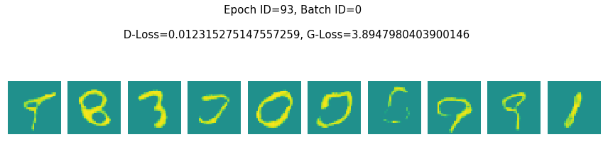


    Epoch ID=93, Batch ID=900 
    
     D-Loss=0.0017580892890691757, G-Loss=3.722109794616699


    Epoch ID=93, Batch ID=1800 
    
     D-Loss=0.005402115639299154, G-Loss=3.8320112228393555


    Epoch ID=94, Batch ID=0 
    
     D-Loss=0.003955158870667219, G-Loss=3.9854989051818848


    Epoch ID=94, Batch ID=900 
    
     D-Loss=0.0014896795619279146, G-Loss=4.004347324371338


    Epoch ID=94, Batch ID=1800 
    
     D-Loss=0.010255733504891396, G-Loss=4.186746597290039


    Epoch ID=95, Batch ID=0 
    
     D-Loss=0.0034865415655076504, G-Loss=3.83657169342041


    Epoch ID=95, Batch ID=900 
    
     D-Loss=0.002626695204526186, G-Loss=3.989358425140381


    Epoch ID=95, Batch ID=1800 
    
     D-Loss=0.0012600352056324482, G-Loss=3.877565383911133


    Epoch ID=96, Batch ID=0 
    
     D-Loss=0.019890572875738144, G-Loss=4.251917839050293


    Epoch ID=96, Batch ID=900 
    
     D-Loss=0.004778568167239428, G-Loss=4.013731956481934


    Epoch ID=96, Batch ID=1800 
    
     D-Loss=0.006569887511432171, G-Loss=4.0499653816223145


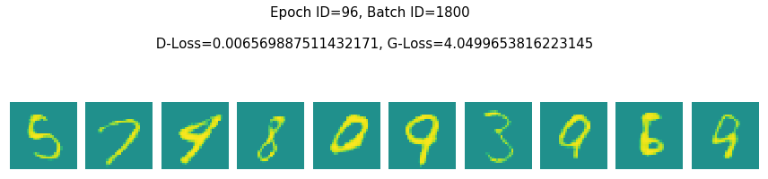


    Epoch ID=97, Batch ID=0 
    
     D-Loss=0.001989977667108178, G-Loss=3.6377811431884766


    Epoch ID=97, Batch ID=900 
    
     D-Loss=0.002764149336144328, G-Loss=4.189318656921387


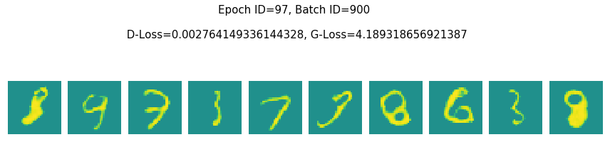


    Epoch ID=97, Batch ID=1800 
    
     D-Loss=0.009153056889772415, G-Loss=4.016511917114258


    Epoch ID=98, Batch ID=0 
    
     D-Loss=0.0021786552388221025, G-Loss=3.899143695831299


    Epoch ID=98, Batch ID=900 
    
     D-Loss=0.0048088571056723595, G-Loss=3.7204630374908447


    Epoch ID=98, Batch ID=1800 
    
     D-Loss=0.07938089966773987, G-Loss=4.441003799438477


    Epoch ID=99, Batch ID=0 
    
     D-Loss=0.012924302369356155, G-Loss=4.20499324798584


    Epoch ID=99, Batch ID=900 
    
     D-Loss=0.005583966616541147, G-Loss=3.971583843231201


    Epoch ID=99, Batch ID=1800 
    
     D-Loss=0.023669885471463203, G-Loss=3.993460178375244


请点击[此处](https://ai.baidu.com/docs#/AIStudio_Project_Notebook/a38e5576)查看本环境基本用法.  <br>
Please click [here ](https://ai.baidu.com/docs#/AIStudio_Project_Notebook/a38e5576) for more detailed instructions. 
