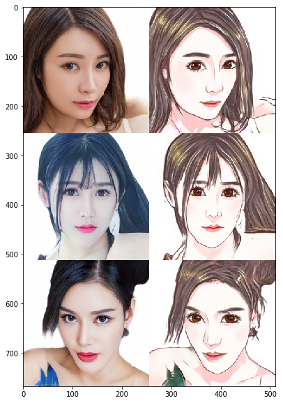
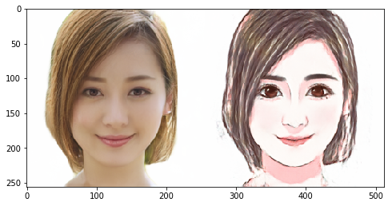

# Day 3 作业--Pixel2Pixel：人像卡通化

经过今天的学习，相信大家对图像翻译、风格迁移有了一定的了解啦，是不是也想自己动手来实现下呢？

那么，为了满足大家动手实践的愿望，同时为了巩固大家学到的知识，我们Day 3的作业便是带大家完成一遍课程讲解过的应用--**Pixel2Pixel：人像卡通化**

在本次作业中，大家需要做的是：**补齐代码，跑通训练，提交一张卡通化的成品图，动手完成自己的第一个人像卡通化的应用~**


## 准备工作：引入依赖 & 数据准备


```python
import paddle
import paddle.nn as nn
from paddle.io import Dataset, DataLoader

import os
import cv2
import numpy as np
from tqdm import tqdm
import matplotlib.pyplot as plt

%matplotlib inline
```

    /opt/conda/envs/python35-paddle120-env/lib/python3.7/site-packages/matplotlib/__init__.py:107: DeprecationWarning: Using or importing the ABCs from 'collections' instead of from 'collections.abc' is deprecated, and in 3.8 it will stop working
      from collections import MutableMapping
    /opt/conda/envs/python35-paddle120-env/lib/python3.7/site-packages/matplotlib/rcsetup.py:20: DeprecationWarning: Using or importing the ABCs from 'collections' instead of from 'collections.abc' is deprecated, and in 3.8 it will stop working
      from collections import Iterable, Mapping
    /opt/conda/envs/python35-paddle120-env/lib/python3.7/site-packages/matplotlib/colors.py:53: DeprecationWarning: Using or importing the ABCs from 'collections' instead of from 'collections.abc' is deprecated, and in 3.8 it will stop working
      from collections import Sized
    2021-04-17 23:27:06,939 - INFO - font search path ['/opt/conda/envs/python35-paddle120-env/lib/python3.7/site-packages/matplotlib/mpl-data/fonts/ttf', '/opt/conda/envs/python35-paddle120-env/lib/python3.7/site-packages/matplotlib/mpl-data/fonts/afm', '/opt/conda/envs/python35-paddle120-env/lib/python3.7/site-packages/matplotlib/mpl-data/fonts/pdfcorefonts']
    2021-04-17 23:27:07,359 - INFO - generated new fontManager


### 数据准备：

- 真人数据来自[seeprettyface](http://www.seeprettyface.com/mydataset.html)。
- 数据预处理（详情见[photo2cartoon](https://github.com/minivision-ai/photo2cartoon)项目）。
<div>
  
</div>

- 使用[photo2cartoon](https://github.com/minivision-ai/photo2cartoon)项目生成真人数据对应的卡通数据。


```python
# 解压数据
!unzip -q data/data79149/cartoon_A2B.zip -d data/
```

### 数据可视化


```python
# 训练数据统计
train_names = os.listdir('data/cartoon_A2B/train')
print(f'训练集数据量: {len(train_names)}')

# 测试数据统计
test_names = os.listdir('data/cartoon_A2B/test')
print(f'测试集数据量: {len(test_names)}')

# 训练数据可视化
imgs = []
for img_name in np.random.choice(train_names, 3, replace=False):
    imgs.append(cv2.imread('data/cartoon_A2B/train/'+img_name))

img_show = np.vstack(imgs)[:,:,::-1]
plt.figure(figsize=(10, 10))
plt.imshow(img_show)
plt.show()
```

    训练集数据量: 1361
    测试集数据量: 100


    /opt/conda/envs/python35-paddle120-env/lib/python3.7/site-packages/matplotlib/cbook/__init__.py:2349: DeprecationWarning: Using or importing the ABCs from 'collections' instead of from 'collections.abc' is deprecated, and in 3.8 it will stop working
      if isinstance(obj, collections.Iterator):
    /opt/conda/envs/python35-paddle120-env/lib/python3.7/site-packages/matplotlib/cbook/__init__.py:2366: DeprecationWarning: Using or importing the ABCs from 'collections' instead of from 'collections.abc' is deprecated, and in 3.8 it will stop working
      return list(data) if isinstance(data, collections.MappingView) else data





```python
class PairedData(Dataset):
    def __init__(self, phase):
        super(PairedData, self).__init__() 
        self.img_path_list = self.load_A2B_data(phase)    # 获取数据列表
        self.num_samples = len(self.img_path_list)        # 数据量

    def __getitem__(self, idx):
        img_A2B = cv2.imread(self.img_path_list[idx])     # 读取一组数据
        img_A2B = img_A2B.astype('float32')/127.5-1       # 从0~255归一化至-1~1
        img_A2B = img_A2B.transpose(2,0,1)                # 维度变换HWC -> CHW
        img_A = img_A2B[...,:256]                         # 真人照
        img_B = img_A2B[...,256:]                         # 卡通图
        return img_A, img_B

    def __len__(self):
        return self.num_samples

    @staticmethod
    def load_A2B_data(phase):
        assert phase in ['train', 'test'], "phase should be set within ['train', 'test']"
        # 读取数据集，数据中每张图像包含照片和对应的卡通画。
        data_path = 'data/cartoon_A2B/'+phase
        return [os.path.join(data_path, x) for x in os.listdir(data_path)]
```


```python
paired_dataset_train = PairedData('train')
paired_dataset_test = PairedData('test')
```

## 第一步：搭建生成器

### 请大家补齐空白处的代码，‘#’ 后是提示。


```python
class UnetGenerator(nn.Layer):
    def __init__(self, input_nc=3, output_nc=3, ngf=64):
        super(UnetGenerator, self).__init__()

        self.down1 = nn.Conv2D(input_nc, ngf, kernel_size=4, stride=2, padding=1)
        self.down2 = Downsample(ngf, ngf*2)
        self.down3 = Downsample(ngf*2, ngf*4)
        self.down4 = Downsample(ngf*4, ngf*8)
        self.down5 = Downsample(ngf*8, ngf*8)
        self.down6 = Downsample(ngf*8, ngf*8)
        self.down7 = Downsample(ngf*8, ngf*8)

        self.center = Downsample(ngf*8, ngf*8)

        self.up7 = Upsample(ngf*8, ngf*8, use_dropout=True)
        self.up6 = Upsample(ngf*8*2, ngf*8, use_dropout=True)
        self.up5 = Upsample(ngf*8*2, ngf*8, use_dropout=True)
        self.up4 = Upsample(ngf*8*2, ngf*8)
        self.up3 = Upsample(ngf*8*2, ngf*4)
        self.up2 = Upsample(ngf*4*2, ngf*2)
        self.up1 = Upsample(ngf*2*2, ngf)

        self.output_block = nn.Sequential(
            nn.ReLU(),
            nn.Conv2DTranspose(ngf*2, output_nc, kernel_size=4, stride=2, padding=1),
            nn.Tanh()
        )

    def forward(self, x):
        d1 = self.down1(x)
        d2 = self.down2(d1)
        d3 = self.down3(d2)
        d4 = self.down4(d3)
        d5 = self.down5(d4)
        d6 = self.down6(d5)
        d7 = self.down7(d6)
        
        c = self.center(d7)
        
        x = self.up7(c, d7)
        x = self.up6(x, d6)
        x = self.up5(x, d5)
        x = self.up4(x, d4)
        x = self.up3(x, d3)
        x = self.up2(x, d2)
        x = self.up1(x, d1)

        x = self.output_block(x)
        return x


class Downsample(nn.Layer):
    # LeakyReLU => conv => batch norm
    def __init__(self, in_dim, out_dim, kernel_size=4, stride=2, padding=1):
        super(Downsample, self).__init__()

        self.layers = nn.Sequential(
            nn.LeakyReLU(0.2),                                        # LeakyReLU, leaky=0.2
            nn.Conv2D(in_dim, out_dim, kernel_size, stride, padding),  # Conv2D
            nn.BatchNorm2D(out_dim)                                   # BatchNorm2D
        )

    def forward(self, x):
        x = self.layers(x)
        return x


class Upsample(nn.Layer):
    # ReLU => deconv => batch norm => dropout
    def __init__(self, in_dim, out_dim, kernel_size=4, stride=2, padding=1, use_dropout=False):
        super(Upsample, self).__init__()

        sequence = [
            nn.ReLU(),                                                           # ReLU
            nn.Conv2DTranspose(in_dim, out_dim, kernel_size, stride, padding),   # Conv2DTranspose
            nn.BatchNorm2D(out_dim)                                              # nn.BatchNorm2D
        ]

        if use_dropout:
            sequence.append(nn.Dropout(p=0.5))

        self.layers = nn.Sequential(*sequence)

    def forward(self, x, skip):
        x = self.layers(x)
        x = paddle.concat([x, skip], axis=1)
        return x
```

## 第二步：鉴别器的搭建

### 请大家补齐空白处的代码，‘#’ 后是提示。


```python
class NLayerDiscriminator(nn.Layer):
    def __init__(self, input_nc=6, ndf=64):
        super(NLayerDiscriminator, self).__init__()

        self.layers = nn.Sequential(
            nn.Conv2D(input_nc, ndf, kernel_size=4, stride=2, padding=1), 
            nn.LeakyReLU(0.2),
            
            ConvBlock(ndf, ndf*2),
            ConvBlock(ndf*2, ndf*4),
            ConvBlock(ndf*4, ndf*8, stride=1),

            nn.Conv2D(ndf*8, 1, kernel_size=4, stride=1, padding=1),
            nn.Sigmoid()
        )

    def forward(self, input):
        return self.layers(input)


class ConvBlock(nn.Layer):
    # conv => batch norm => LeakyReLU
    def __init__(self, in_dim, out_dim, kernel_size=4, stride=2, padding=1):
        super(ConvBlock, self).__init__()

        self.layers = nn.Sequential(
            nn.Conv2D(in_dim, out_dim, kernel_size, stride, padding),  # Conv2D
            nn.BatchNorm2D(out_dim),                                   # BatchNorm2D
            nn.LeakyReLU(0.2),                                         # LeakyReLU, leaky=0.2
        )

    def forward(self, x):
        x = self.layers(x)
        return x
```


```python
generator = UnetGenerator()
discriminator = NLayerDiscriminator()
```


```python
out = generator(paddle.ones([1, 3, 256, 256]))
print('生成器输出尺寸：', out.shape)  # 应为[1, 3, 256, 256]

out = discriminator(paddle.ones([1, 6, 256, 256]))
print('鉴别器输出尺寸：', out.shape)  # 应为[1, 1, 30, 30]
```

    生成器输出尺寸： [1, 3, 256, 256]
    鉴别器输出尺寸： [1, 1, 30, 30]


    /opt/conda/envs/python35-paddle120-env/lib/python3.7/site-packages/paddle/nn/layer/norm.py:648: UserWarning: When training, we now always track global mean and variance.
      "When training, we now always track global mean and variance.")


```python
# 超参数
LR = 1e-4
BATCH_SIZE = 8
EPOCHS = 100

# 优化器
optimizerG = paddle.optimizer.Adam(
    learning_rate=LR,
    parameters=generator.parameters(),
    beta1=0.5,
    beta2=0.999)

optimizerD = paddle.optimizer.Adam(
    learning_rate=LR,
    parameters=discriminator.parameters(), 
    beta1=0.5,
    beta2=0.999)
    
# 损失函数
bce_loss = nn.BCELoss()
l1_loss = nn.L1Loss()

# dataloader
data_loader_train = DataLoader(
    paired_dataset_train,
    batch_size=BATCH_SIZE,
    shuffle=True,
    drop_last=True
    )

data_loader_test = DataLoader(
    paired_dataset_test,
    batch_size=BATCH_SIZE
    )
```


```python
results_save_path = 'work/results'
os.makedirs(results_save_path, exist_ok=True)  # 保存每个epoch的测试结果

weights_save_path = 'work/weights'
os.makedirs(weights_save_path, exist_ok=True)  # 保存模型

for epoch in range(EPOCHS):
    for data in tqdm(data_loader_train):
        real_A, real_B = data
        
        optimizerD.clear_grad()
        # D([real_A, real_B])
        real_AB = paddle.concat((real_A, real_B), 1)
        d_real_predict = discriminator(real_AB)
        d_real_loss = bce_loss(d_real_predict, paddle.ones_like(d_real_predict))

        # D([real_A, fake_B])
        fake_B = generator(real_A).detach()
        fake_AB = paddle.concat((real_A, fake_B), 1)
        d_fake_predict = discriminator(fake_AB)
        d_fake_loss = bce_loss(d_fake_predict, paddle.zeros_like(d_fake_predict))
        
        # train D
        d_loss = (d_real_loss + d_fake_loss) / 2.
        d_loss.backward()
        optimizerD.step()

        optimizerG.clear_grad()
        # D([real_A, fake_B])
        fake_B = generator(real_A)
        fake_AB = paddle.concat((real_A, fake_B), 1)
        g_fake_predict = discriminator(fake_AB)
        g_bce_loss = bce_loss(g_fake_predict, paddle.ones_like(g_fake_predict))
        g_l1_loss = l1_loss(fake_B,real_B)
        g_loss = g_bce_loss + g_l1_loss * 100.
        
        # train G
        g_loss.backward()
        optimizerG.step()

    print(f'Epoch [{epoch+1}/{EPOCHS}] Loss D: {d_loss.numpy()}, Loss G: {g_loss.numpy()}')

    if (epoch+1) % 10 == 0:
        paddle.save(generator.state_dict(), os.path.join(weights_save_path, 'epoch'+str(epoch+1).zfill(3)+'.pdparams'))

        # test
        generator.eval()
        with paddle.no_grad():
            for data in data_loader_test:
                real_A, real_B = data
                break

            fake_B = generator(real_A)
            result = paddle.concat([real_A[:3], real_B[:3], fake_B[:3]], 3)

            result = result.detach().numpy().transpose(0, 2, 3, 1)
            result = np.vstack(result)
            result = (result * 127.5 + 127.5).astype(np.uint8)
    
        cv2.imwrite(os.path.join(results_save_path, 'epoch'+str(epoch+1).zfill(3)+'.png'), result)

        generator.train()
```

      0%|          | 0/170 [00:00<?, ?it/s]/opt/conda/envs/python35-paddle120-env/lib/python3.7/site-packages/paddle/nn/layer/norm.py:648: UserWarning: When training, we now always track global mean and variance.
      "When training, we now always track global mean and variance.")
    100%|██████████| 170/170 [00:24<00:00,  7.06it/s]
      1%|          | 1/170 [00:00<00:26,  6.44it/s]

    Epoch [1/100] Loss D: [0.46974725], Loss G: [12.669323]


    100%|██████████| 170/170 [00:23<00:00,  7.16it/s]
      1%|          | 1/170 [00:00<00:25,  6.71it/s]

    Epoch [2/100] Loss D: [0.5228054], Loss G: [11.758549]


    100%|██████████| 170/170 [00:23<00:00,  7.09it/s]
      1%|          | 1/170 [00:00<00:30,  5.56it/s]

    Epoch [3/100] Loss D: [0.6167724], Loss G: [11.223191]


    100%|██████████| 170/170 [00:24<00:00,  7.04it/s]
      1%|          | 1/170 [00:00<00:29,  5.65it/s]

    Epoch [4/100] Loss D: [0.63291836], Loss G: [10.859179]


      1%|          | 2/170 [00:00<00:27,  6.19it/s]100%|██████████| 170/170 [00:24<00:00,  7.06it/s]
      1%|          | 1/170 [00:00<00:26,  6.31it/s]

    Epoch [5/100] Loss D: [0.5245445], Loss G: [10.636589]


      4%|▍         | 7/170 [00:00<00:23,  7.03it/s]100%|██████████| 170/170 [00:24<00:00,  7.03it/s]
      1%|          | 1/170 [00:00<00:28,  5.95it/s]

    Epoch [6/100] Loss D: [0.6468226], Loss G: [10.634507]


    100%|██████████| 170/170 [00:24<00:00,  7.03it/s]
      1%|          | 1/170 [00:00<00:26,  6.28it/s]

    Epoch [7/100] Loss D: [0.5596558], Loss G: [10.619603]


    100%|██████████| 170/170 [00:24<00:00,  7.02it/s]
      1%|          | 1/170 [00:00<00:25,  6.54it/s]

    Epoch [8/100] Loss D: [0.62051076], Loss G: [10.754689]


      1%|          | 2/170 [00:00<00:25,  6.61it/s]100%|██████████| 170/170 [00:24<00:00,  7.07it/s]
      1%|          | 1/170 [00:00<00:27,  6.19it/s]

    Epoch [9/100] Loss D: [0.6472603], Loss G: [10.221222]


    100%|██████████| 170/170 [00:24<00:00,  7.01it/s]


    Epoch [10/100] Loss D: [0.6434967], Loss G: [9.180807]


    100%|██████████| 170/170 [00:24<00:00,  7.00it/s]
      1%|          | 1/170 [00:00<00:27,  6.18it/s]

    Epoch [11/100] Loss D: [0.63613683], Loss G: [9.191601]


    100%|██████████| 170/170 [00:24<00:00,  7.03it/s]
      1%|          | 1/170 [00:00<00:25,  6.65it/s]

    Epoch [12/100] Loss D: [0.63845736], Loss G: [9.100979]


    100%|██████████| 170/170 [00:24<00:00,  7.06it/s]
      1%|          | 1/170 [00:00<00:29,  5.73it/s]

    Epoch [13/100] Loss D: [0.7089863], Loss G: [9.085732]


      1%|          | 2/170 [00:00<00:27,  6.16it/s]100%|██████████| 170/170 [00:24<00:00,  7.05it/s]
      1%|          | 1/170 [00:00<00:25,  6.55it/s]

    Epoch [14/100] Loss D: [0.6293729], Loss G: [8.834716]


    100%|██████████| 170/170 [00:24<00:00,  7.06it/s]
      1%|          | 1/170 [00:00<00:25,  6.75it/s]

    Epoch [15/100] Loss D: [0.7089899], Loss G: [8.74235]


    100%|██████████| 170/170 [00:24<00:00,  7.05it/s]
      1%|          | 1/170 [00:00<00:28,  5.99it/s]

    Epoch [16/100] Loss D: [0.66816205], Loss G: [8.877164]


    100%|██████████| 170/170 [00:24<00:00,  7.01it/s]
      1%|          | 1/170 [00:00<00:29,  5.77it/s]

    Epoch [17/100] Loss D: [0.6501931], Loss G: [7.8990164]


    100%|██████████| 170/170 [00:24<00:00,  7.05it/s]
      1%|          | 1/170 [00:00<00:26,  6.46it/s]

    Epoch [18/100] Loss D: [0.58922815], Loss G: [7.87694]


    100%|██████████| 170/170 [00:24<00:00,  7.03it/s]
      1%|          | 1/170 [00:00<00:26,  6.40it/s]

    Epoch [19/100] Loss D: [0.6734001], Loss G: [7.734768]


    100%|██████████| 170/170 [00:24<00:00,  7.01it/s]


    Epoch [20/100] Loss D: [0.6920767], Loss G: [7.769308]


    100%|██████████| 170/170 [00:24<00:00,  7.08it/s]
      1%|          | 1/170 [00:00<00:28,  5.85it/s]

    Epoch [21/100] Loss D: [0.7323042], Loss G: [7.676842]


    100%|██████████| 170/170 [00:24<00:00,  7.01it/s]
      1%|          | 1/170 [00:00<00:29,  5.76it/s]

    Epoch [22/100] Loss D: [0.6225929], Loss G: [7.3321605]


    100%|██████████| 170/170 [00:24<00:00,  7.07it/s]
      1%|          | 1/170 [00:00<00:26,  6.34it/s]

    Epoch [23/100] Loss D: [0.667369], Loss G: [7.306199]


    100%|██████████| 170/170 [00:24<00:00,  7.03it/s]
      1%|          | 1/170 [00:00<00:25,  6.59it/s]

    Epoch [24/100] Loss D: [0.5667399], Loss G: [7.571594]


      1%|          | 2/170 [00:00<00:25,  6.69it/s]100%|██████████| 170/170 [00:24<00:00,  7.06it/s]
      1%|          | 1/170 [00:00<00:27,  6.04it/s]

    Epoch [25/100] Loss D: [0.56643534], Loss G: [7.034196]


    100%|██████████| 170/170 [00:24<00:00,  7.02it/s]
      1%|          | 1/170 [00:00<00:25,  6.50it/s]

    Epoch [26/100] Loss D: [0.5935126], Loss G: [6.6580744]


    100%|██████████| 170/170 [00:24<00:00,  7.07it/s]
      1%|          | 1/170 [00:00<00:25,  6.64it/s]

    Epoch [27/100] Loss D: [0.6527803], Loss G: [7.009963]


    100%|██████████| 170/170 [00:24<00:00,  7.08it/s]
      1%|          | 1/170 [00:00<00:25,  6.55it/s]

    Epoch [28/100] Loss D: [0.63413733], Loss G: [6.853889]


    100%|██████████| 170/170 [00:24<00:00,  7.05it/s]
      1%|          | 1/170 [00:00<00:27,  6.12it/s]

    Epoch [29/100] Loss D: [0.64820385], Loss G: [6.6115265]


    100%|██████████| 170/170 [00:24<00:00,  7.04it/s]


    Epoch [30/100] Loss D: [0.61603034], Loss G: [6.320271]


    100%|██████████| 170/170 [00:24<00:00,  7.05it/s]
      1%|          | 1/170 [00:00<00:26,  6.47it/s]

    Epoch [31/100] Loss D: [0.6801091], Loss G: [6.2719426]


    100%|██████████| 170/170 [00:24<00:00,  7.06it/s]
      1%|          | 1/170 [00:00<00:25,  6.60it/s]

    Epoch [32/100] Loss D: [0.6219048], Loss G: [6.37118]


    100%|██████████| 170/170 [00:24<00:00,  7.05it/s]
      1%|          | 1/170 [00:00<00:26,  6.31it/s]

    Epoch [33/100] Loss D: [0.6692323], Loss G: [6.4135866]


    100%|██████████| 170/170 [00:24<00:00,  7.04it/s]
      1%|          | 1/170 [00:00<00:25,  6.75it/s]

    Epoch [34/100] Loss D: [0.61254865], Loss G: [6.290985]


    100%|██████████| 170/170 [00:24<00:00,  7.07it/s]
      1%|          | 1/170 [00:00<00:26,  6.50it/s]

    Epoch [35/100] Loss D: [0.67696226], Loss G: [6.1525655]


    100%|██████████| 170/170 [00:24<00:00,  7.03it/s]
      1%|          | 1/170 [00:00<00:31,  5.33it/s]

    Epoch [36/100] Loss D: [0.60716796], Loss G: [6.0944667]


    100%|██████████| 170/170 [00:24<00:00,  7.05it/s]
      1%|          | 1/170 [00:00<00:26,  6.48it/s]

    Epoch [37/100] Loss D: [0.67651224], Loss G: [6.0230875]


    100%|██████████| 170/170 [00:23<00:00,  7.10it/s]
      1%|          | 1/170 [00:00<00:28,  6.02it/s]

    Epoch [38/100] Loss D: [0.81227195], Loss G: [6.5195446]


    100%|██████████| 170/170 [00:24<00:00,  7.05it/s]
      1%|          | 1/170 [00:00<00:26,  6.39it/s]

    Epoch [39/100] Loss D: [0.6362471], Loss G: [5.662526]


    100%|██████████| 170/170 [00:24<00:00,  7.08it/s]


    Epoch [40/100] Loss D: [0.6131458], Loss G: [5.993131]


    100%|██████████| 170/170 [00:24<00:00,  7.07it/s]
      1%|          | 1/170 [00:00<00:29,  5.76it/s]

    Epoch [41/100] Loss D: [0.64990735], Loss G: [5.7681637]


    100%|██████████| 170/170 [00:24<00:00,  7.07it/s]
      1%|          | 1/170 [00:00<00:29,  5.68it/s]

    Epoch [42/100] Loss D: [0.67600965], Loss G: [5.565955]


    100%|██████████| 170/170 [00:23<00:00,  7.09it/s]
      1%|          | 1/170 [00:00<00:29,  5.75it/s]

    Epoch [43/100] Loss D: [0.66029006], Loss G: [5.7827373]


    100%|██████████| 170/170 [00:24<00:00,  7.06it/s]
      1%|          | 1/170 [00:00<00:28,  6.00it/s]

    Epoch [44/100] Loss D: [0.8103389], Loss G: [5.5649667]


    100%|██████████| 170/170 [00:24<00:00,  7.07it/s]
      1%|          | 1/170 [00:00<00:28,  5.84it/s]

    Epoch [45/100] Loss D: [0.6596291], Loss G: [5.6625376]


    100%|██████████| 170/170 [00:24<00:00,  7.04it/s]
      1%|          | 1/170 [00:00<00:27,  6.15it/s]

    Epoch [46/100] Loss D: [0.660621], Loss G: [5.159322]


    100%|██████████| 170/170 [00:23<00:00,  7.09it/s]
      1%|          | 1/170 [00:00<00:27,  6.06it/s]

    Epoch [47/100] Loss D: [0.64894676], Loss G: [5.3660703]


      1%|          | 2/170 [00:00<00:26,  6.35it/s]100%|██████████| 170/170 [00:23<00:00,  7.15it/s]
      1%|          | 1/170 [00:00<00:28,  5.94it/s]

    Epoch [48/100] Loss D: [0.650892], Loss G: [5.238788]


    100%|██████████| 170/170 [00:24<00:00,  7.02it/s]
      1%|          | 1/170 [00:00<00:28,  5.96it/s]

    Epoch [49/100] Loss D: [0.6647741], Loss G: [5.557625]


    100%|██████████| 170/170 [00:23<00:00,  7.10it/s]


    Epoch [50/100] Loss D: [0.6359325], Loss G: [5.469408]


    100%|██████████| 170/170 [00:24<00:00,  7.05it/s]
      1%|          | 1/170 [00:00<00:25,  6.57it/s]

    Epoch [51/100] Loss D: [0.6547793], Loss G: [5.3864646]


    100%|██████████| 170/170 [00:23<00:00,  7.09it/s]
      1%|          | 1/170 [00:00<00:25,  6.61it/s]

    Epoch [52/100] Loss D: [0.642764], Loss G: [5.5448294]


    100%|██████████| 170/170 [00:24<00:00,  7.06it/s]
      1%|          | 1/170 [00:00<00:27,  6.12it/s]

    Epoch [53/100] Loss D: [0.6394432], Loss G: [5.458886]


    100%|██████████| 170/170 [00:23<00:00,  7.11it/s]
      1%|          | 1/170 [00:00<00:25,  6.62it/s]

    Epoch [54/100] Loss D: [0.6641098], Loss G: [5.146925]


    100%|██████████| 170/170 [00:24<00:00,  7.06it/s]
      1%|          | 1/170 [00:00<00:28,  6.02it/s]

    Epoch [55/100] Loss D: [0.63569826], Loss G: [4.817876]


    100%|██████████| 170/170 [00:23<00:00,  7.11it/s]
      1%|          | 1/170 [00:00<00:26,  6.43it/s]

    Epoch [56/100] Loss D: [0.6370233], Loss G: [5.46414]


    100%|██████████| 170/170 [00:24<00:00,  7.03it/s]
      1%|          | 1/170 [00:00<00:25,  6.66it/s]

    Epoch [57/100] Loss D: [0.6953917], Loss G: [5.1367197]


    100%|██████████| 170/170 [00:24<00:00,  7.01it/s]
      1%|          | 1/170 [00:00<00:24,  6.78it/s]

    Epoch [58/100] Loss D: [0.64096725], Loss G: [4.9014826]


    100%|██████████| 170/170 [00:24<00:00,  7.03it/s]
      1%|          | 1/170 [00:00<00:26,  6.29it/s]

    Epoch [59/100] Loss D: [0.6366298], Loss G: [5.080572]


    100%|██████████| 170/170 [00:24<00:00,  7.06it/s]


    Epoch [60/100] Loss D: [0.6541061], Loss G: [5.1573324]


    100%|██████████| 170/170 [00:24<00:00,  7.02it/s]
      1%|          | 1/170 [00:00<00:27,  6.16it/s]

    Epoch [61/100] Loss D: [0.66760194], Loss G: [4.81458]


    100%|██████████| 170/170 [00:24<00:00,  7.08it/s]
      1%|          | 1/170 [00:00<00:25,  6.73it/s]

    Epoch [62/100] Loss D: [0.6375445], Loss G: [5.0413384]


      1%|          | 2/170 [00:00<00:24,  6.82it/s]100%|██████████| 170/170 [00:24<00:00,  7.02it/s]
      1%|          | 1/170 [00:00<00:25,  6.72it/s]

    Epoch [63/100] Loss D: [0.64743197], Loss G: [5.284639]


      1%|          | 2/170 [00:00<00:24,  6.83it/s]100%|██████████| 170/170 [00:24<00:00,  7.04it/s]
      1%|          | 1/170 [00:00<00:25,  6.73it/s]

    Epoch [64/100] Loss D: [0.6421586], Loss G: [4.9838586]


    100%|██████████| 170/170 [00:24<00:00,  7.03it/s]
      1%|          | 1/170 [00:00<00:26,  6.43it/s]

    Epoch [65/100] Loss D: [0.6367655], Loss G: [4.8012714]


    100%|██████████| 170/170 [00:24<00:00,  7.02it/s]
      1%|          | 1/170 [00:00<00:25,  6.59it/s]

    Epoch [66/100] Loss D: [0.6282314], Loss G: [4.8369737]


    100%|██████████| 170/170 [00:23<00:00,  7.16it/s]
      1%|          | 1/170 [00:00<00:30,  5.57it/s]

    Epoch [67/100] Loss D: [0.65765387], Loss G: [4.652611]


    100%|██████████| 170/170 [00:24<00:00,  7.05it/s]
      1%|          | 1/170 [00:00<00:26,  6.38it/s]

    Epoch [68/100] Loss D: [0.689517], Loss G: [4.4214597]


    100%|██████████| 170/170 [00:23<00:00,  7.10it/s]
      1%|          | 1/170 [00:00<00:27,  6.14it/s]

    Epoch [69/100] Loss D: [0.6702093], Loss G: [4.9824114]


    100%|██████████| 170/170 [00:23<00:00,  7.09it/s]


    Epoch [70/100] Loss D: [0.6393359], Loss G: [4.5759873]


    100%|██████████| 170/170 [00:24<00:00,  7.06it/s]
      1%|          | 1/170 [00:00<00:27,  6.23it/s]

    Epoch [71/100] Loss D: [0.6468396], Loss G: [4.769438]


    100%|██████████| 170/170 [00:23<00:00,  7.09it/s]
      1%|          | 1/170 [00:00<00:24,  6.81it/s]

    Epoch [72/100] Loss D: [0.6674439], Loss G: [4.5809565]


    100%|██████████| 170/170 [00:24<00:00,  7.00it/s]
      1%|          | 1/170 [00:00<00:27,  6.04it/s]

    Epoch [73/100] Loss D: [0.6450912], Loss G: [4.7683535]


    100%|██████████| 170/170 [00:24<00:00,  7.04it/s]
      1%|          | 1/170 [00:00<00:25,  6.64it/s]

    Epoch [74/100] Loss D: [0.66275835], Loss G: [4.7326503]


    100%|██████████| 170/170 [00:24<00:00,  7.06it/s]
      1%|          | 1/170 [00:00<00:30,  5.57it/s]

    Epoch [75/100] Loss D: [0.6380098], Loss G: [4.601114]


    100%|██████████| 170/170 [00:24<00:00,  7.02it/s]
      1%|          | 1/170 [00:00<00:27,  6.16it/s]

    Epoch [76/100] Loss D: [0.6312127], Loss G: [4.9424577]


    100%|██████████| 170/170 [00:24<00:00,  7.02it/s]
      1%|          | 1/170 [00:00<00:24,  6.85it/s]

    Epoch [77/100] Loss D: [0.6312877], Loss G: [4.5983257]


    100%|██████████| 170/170 [00:24<00:00,  7.05it/s]
      1%|          | 1/170 [00:00<00:27,  6.04it/s]

    Epoch [78/100] Loss D: [0.64542115], Loss G: [4.258643]


    100%|██████████| 170/170 [00:24<00:00,  7.06it/s]
      1%|          | 1/170 [00:00<00:28,  6.01it/s]

    Epoch [79/100] Loss D: [0.71359736], Loss G: [5.200747]


      1%|          | 2/170 [00:00<00:26,  6.37it/s]100%|██████████| 170/170 [00:24<00:00,  7.06it/s]


    Epoch [80/100] Loss D: [0.6157975], Loss G: [4.3986897]


    100%|██████████| 170/170 [00:24<00:00,  7.00it/s]
      1%|          | 1/170 [00:00<00:27,  6.24it/s]

    Epoch [81/100] Loss D: [0.6318071], Loss G: [4.531223]


    100%|██████████| 170/170 [00:24<00:00,  7.06it/s]
      1%|          | 1/170 [00:00<00:26,  6.42it/s]

    Epoch [82/100] Loss D: [0.6721432], Loss G: [4.7575316]


    100%|██████████| 170/170 [00:24<00:00,  7.05it/s]
      1%|          | 1/170 [00:00<00:27,  6.06it/s]

    Epoch [83/100] Loss D: [0.6598171], Loss G: [4.6874948]


    100%|██████████| 170/170 [00:24<00:00,  6.96it/s]
      1%|          | 1/170 [00:00<00:28,  5.88it/s]

    Epoch [84/100] Loss D: [0.65606654], Loss G: [4.376697]


    100%|██████████| 170/170 [00:23<00:00,  7.09it/s]
      1%|          | 1/170 [00:00<00:25,  6.68it/s]

    Epoch [85/100] Loss D: [0.6873861], Loss G: [4.6553745]


    100%|██████████| 170/170 [00:23<00:00,  7.16it/s]
      1%|          | 1/170 [00:00<00:24,  6.89it/s]

    Epoch [86/100] Loss D: [0.69934404], Loss G: [4.4620085]


    100%|██████████| 170/170 [00:23<00:00,  7.19it/s]
      1%|          | 1/170 [00:00<00:24,  6.86it/s]

    Epoch [87/100] Loss D: [0.63404524], Loss G: [4.1068206]


    100%|██████████| 170/170 [00:24<00:00,  7.05it/s]
      1%|          | 1/170 [00:00<00:27,  6.20it/s]

    Epoch [88/100] Loss D: [0.6733465], Loss G: [4.460137]


    100%|██████████| 170/170 [00:24<00:00,  7.02it/s]
      1%|          | 1/170 [00:00<00:26,  6.44it/s]

    Epoch [89/100] Loss D: [0.65754944], Loss G: [4.3183084]


    100%|██████████| 170/170 [00:24<00:00,  7.04it/s]


    Epoch [90/100] Loss D: [0.6368704], Loss G: [4.120587]


    100%|██████████| 170/170 [00:24<00:00,  7.05it/s]
      1%|          | 1/170 [00:00<00:29,  5.79it/s]

    Epoch [91/100] Loss D: [0.6604266], Loss G: [4.5594044]


      1%|          | 2/170 [00:00<00:27,  6.11it/s]100%|██████████| 170/170 [00:24<00:00,  7.08it/s]
      1%|          | 1/170 [00:00<00:29,  5.82it/s]

    Epoch [92/100] Loss D: [0.65938795], Loss G: [4.3260016]


      1%|          | 2/170 [00:00<00:26,  6.23it/s]100%|██████████| 170/170 [00:24<00:00,  7.03it/s]
      1%|          | 1/170 [00:00<00:29,  5.76it/s]

    Epoch [93/100] Loss D: [0.70060897], Loss G: [4.3610883]


    100%|██████████| 170/170 [00:23<00:00,  7.12it/s]
      1%|          | 1/170 [00:00<00:26,  6.46it/s]

    Epoch [94/100] Loss D: [0.65306616], Loss G: [4.099472]


    100%|██████████| 170/170 [00:24<00:00,  7.06it/s]
      1%|          | 1/170 [00:00<00:26,  6.32it/s]

    Epoch [95/100] Loss D: [0.64706486], Loss G: [4.6437464]


    100%|██████████| 170/170 [00:24<00:00,  7.08it/s]
      1%|          | 1/170 [00:00<00:29,  5.79it/s]

    Epoch [96/100] Loss D: [0.6405841], Loss G: [4.446477]


    100%|██████████| 170/170 [00:24<00:00,  7.02it/s]
      1%|          | 1/170 [00:00<00:32,  5.27it/s]

    Epoch [97/100] Loss D: [0.64999837], Loss G: [4.5222664]


    100%|██████████| 170/170 [00:24<00:00,  7.06it/s]
      1%|          | 1/170 [00:00<00:24,  6.80it/s]

    Epoch [98/100] Loss D: [0.64653474], Loss G: [4.5875535]


    100%|██████████| 170/170 [00:24<00:00,  7.02it/s]
      1%|          | 1/170 [00:00<00:26,  6.26it/s]

    Epoch [99/100] Loss D: [0.6734077], Loss G: [4.1461444]


    100%|██████████| 170/170 [00:24<00:00,  7.04it/s]


    Epoch [100/100] Loss D: [0.66190267], Loss G: [4.466887]


## 最后：用你补齐的代码试试卡通化的效果吧！


```python
# 为生成器加载权重
last_weights_path = os.path.join(weights_save_path, sorted(os.listdir(weights_save_path))[-1])
print('加载权重:', last_weights_path)

model_state_dict = paddle.load(last_weights_path)
generator.load_dict(model_state_dict)
generator.eval()
```

    加载权重: work/weights/epoch100.pdparams


```python
# 读取数据
test_names = os.listdir('data/cartoon_A2B/test')
img_name = np.random.choice(test_names)
img_A2B = cv2.imread('data/cartoon_A2B/test/'+img_name)
img_A = img_A2B[:, :256]                                  # 真人照
img_B = img_A2B[:, 256:]                                  # 卡通图

g_input = img_A.astype('float32') / 127.5 - 1             # 归一化
g_input = g_input[np.newaxis, ...].transpose(0, 3, 1, 2)  # NHWC -> NCHW
g_input = paddle.to_tensor(g_input)                       # numpy -> tensor

g_output = generator(g_input)
g_output = g_output.detach().numpy()                      # tensor -> numpy
g_output = g_output.transpose(0, 2, 3, 1)[0]              # NCHW -> NHWC
g_output = g_output * 127.5 + 127.5                       # 反归一化
g_output = g_output.astype(np.uint8)

img_show = np.hstack([img_A, g_output])[:,:,::-1]
plt.figure(figsize=(8, 8))
plt.imshow(img_show)
plt.show()
```




